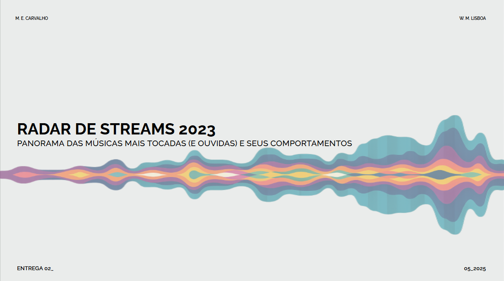

  

# Validação de Hipóteses no Contexto Musical

### Equipe: Maria Eduarda Carvalho e Wellen Mariah Lisboa

## Contexto

Uma gravadora levantou uma série de hipóteses sobre o que faz uma música ser mais ouvida. Essas hipóteses incluem:

- Músicas com BPM (Batidas Por Minuto) mais altos fazem mais sucesso em termos de número de streams no Spotify.
- As músicas mais populares no ranking do Spotify também possuem um comportamento semelhante em outras plataformas, como a Deezer.
- A presença de uma música em um maior número de playlists está correlacionada com um maior número de streams.
- Artistas com um maior número de músicas no Spotify têm mais streams.
- As características da música influenciam o sucesso em termos de número de streams no Spotify.

O objetivo é saber quais fatores contribuem para o sucesso de uma música em diversas plataformas de streaming. Com o intuito de lançar
uma novo artista no mercado musical, a gravadora em questão deseja receber recomendações estratégicas com base em dados para que decisões
informadas possam ser tomadas e suas chances de alcançar o “sucesso” aumentem.

## Objetivos

- Analisar e responder as hipóteses levantadas pela gravadora.
- Identificar padrões ou características que possam influenciar a popularidade de uma música em plataformas como o Spotify, AppleMusic
e Deezer, determinando os fatores que contribuem para o sucesso de uma música.
 

  
<strong>⚙️ Ferramentas e Tecnologias: </strong>

   
  
- **BigQuery (utilizando SQL)**
- **PowerBI (foi utilizado Python para cosntrução de gráficos)**
- **Google Colab (foi utilizado Python para aplicação dos testes estatísticos)**
- **Notion (gerenciamento de tempo e progresso)**
- **Google Documentos (montagem da ficha técnica)**
   

  
<strong>📂 Processamentos e Análises: </strong>

   
  
A partir da base tratada, foram exploradas correlações, distribuições e padrões gerais que ajudaram a entender a estrutura dos dados.
Esta etapa forneceu insumos valiosos para aprofundar a análise e ajustar hipóteses iniciais.
  
  - **1. Imporatação dos dados** 
  - **2. Limpeza dos dados** 
  - **3. Verificar e alterar tipos de dados**
  - **4. Criar novas variáveis + Unir tabelas + Contruir tabelas auxiliares** 

  
<strong>🧭 Análises Aplicadas: </strong>

   
  
As hipóteses definidas no início do projeto foram testadas com análises descritivas e comparativas. As respostas foram
embasadas com visualizações e indicadores quantitativos, permitindo verificar a aderência dos dados a comportamentos
esperados.
  
  - **Hipótese 1 - Músicas com BPM mais altos fazem mais sucesso no Spotify.** 
  - **Hipótese 2 - As músicas mais populares no Spotify também possuem um comportamento semelhante em outras plataformas
    como Deezer, Apple Music e Shazam.** 
  - **Hipótese 3 - A presença de uma música em um maior número de playlists está relacionada a um maior número de streams.**
  - **Hipótese 4 - Artistas com maior número de músicas no Spotify têm mais streams.**
  - **Hipótese 5 - As características da música influenciam no sucesso em termos de streams no Spotify.**

  
<strong>🎯 Análises de Nicho: Top Hits</strong>

   
Com base na segmentação das faixas mais populares, foi feita uma análise específica sobre as características que mais
aparecem em músicas classificadas como "Top Hits". Isso permitiu identificar padrões únicos desse grupo em comparação com
o restante da base.
  

  
<strong>🏁 Resultados e Conclusões: </strong>

   
A análise confirmou parcialmente algumas hipóteses e rejeitou outras, apontando tendências interessantes como a relação
entre energia e popularidade ou o impacto da duração média nas faixas mais ouvidas. As conclusões fornecem direções para
estudos futuros e estratégias de curadoria musical.

## 🔗 Links Úteis:
 

  - 📘 [Relatório Documentado (Notion)](https://www.notion.so/FICHA-T-CNICA_-PROJETO-2-HIP-TESES-200b5d322028808ba872c03248cce5ac?source=copy_link)
  - 🎞️ [Vídeo-Apresentação (Loom)](https://www.loom.com/share/24c6f18dc84f4f5f89d6baaa9642ea65?sid=1738ba5c-f3e2-491b-8c72-26b512a665f5)
  - 🗂️ [Link para o notebook de testes estatísticos (Google Colab)](https://colab.research.google.com/drive/1quOxk92ReWGKQInZWJTejArk3STQUP76?usp=sharing)

  
